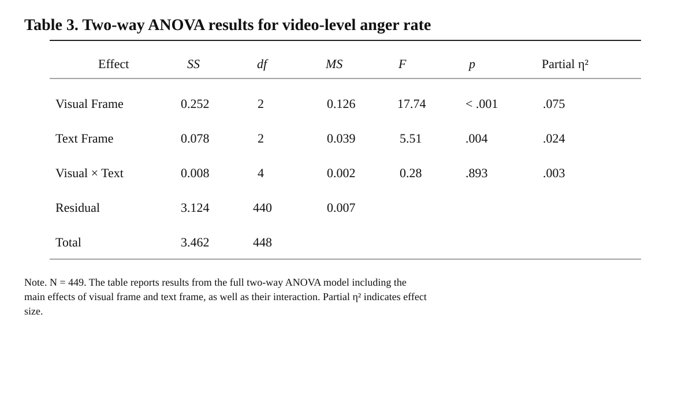

Sorry, I forgot to put this table on the poster.

# Visual–Textual Frames and Anger in Short-Video Comments

This repository contains the public replication materials for:

> **Don’t be too calm: How does the combination of visual and textual frames influence expressions of anger in short video comment sections?**
>
> Accepted by the AEJMC 2026 Visual Communication Division.

The accepted paper is available here, clicking it if you like! [PDF](AEJMC_VISC_FP-19-9246.pdf)

## Study Overview

This study examines how visual and textual frames are combined in short videos and how these combinations are associated with anger expressed in comment sections. The analysis covers 449 Douyin videos about the debate over sealing drug-use records in China and 419,126 analyzed top-level comments.

Each video is coded using the same three-category framework for both modalities:

- **Intensifying** frames heighten conflict, threat, blame, or moral condemnation.
- **Informational** frames emphasize factual description, explanation, or policy context.
- **Mitigating** frames reduce conflict, provide reassurance, or encourage restraint.

The workflow combines representative-frame extraction and LLM-supported visual coding, aggregation and human coding of textual content, BERT-based anger detection at the comment level, and video-level statistical analysis.

## Main Results

- The anger classifier identified 48,973 angry comments, representing 11.68% of all analyzed comments.
- Visual and textual frame categories were statistically associated rather than independent, χ²(4) = 50.171, p < .001, Cramér's V = .236.
- Anger rates differed across the nine visual–textual frame combinations, Kruskal–Wallis H(8) = 50.984, p < .001.
- Videos combining mitigating visual and textual frames had the lowest observed mean anger rate (6.44%) and the lowest fractional-logit prediction (6.44%, 95% CI [5.34%, 7.75%]).
- In the two-way ANOVA, visual frames, F(2, 440) = 17.736, p < .001, and textual frames, F(2, 440) = 5.509, p = .004, showed significant statistical main effects. Their interaction was not significant, F(4, 440) = 0.277, p = .893.
- In the repository's controlled OLS reproduction, the visual and textual frame terms remained jointly significant after controlling for likes, follower count, and publication time, while the interaction remained non-significant.

Together, the results indicate that visual and textual framing are both associated with anger expression. The evidence is consistent with separate main associations rather than a detectable interaction.

## Main Contributions

1. **A multimodal account of short-video framing.** The study analyzes visual and textual frames within the same videos, showing that the two modalities were statistically associated and often aligned in the sampled content.
2. **Evidence about emotional expression in comment sections.** It links multimodal framing to an observed comment-section outcome—expressed anger—and separates the modalities' main statistical associations from their interaction.
3. **A scalable approach to dynamic visual content.** The project provides a workflow for reducing continuous video into representative visual units, supporting visual coding with LLM-generated descriptions, coding aggregated textual content under the same framework, classifying comment-level anger, and linking these measures at the video level.

## Data

The final analytic file is [`data/processed/video_level_master_449.csv`](data/processed/video_level_master_449.csv). It contains one row per video and retains:

- the repository case number, original platform video ID, and canonical Douyin URL;
- author, title, publication time, likes, and follower count;
- dominant visual and textual frame labels; and
- analyzed-comment counts, anger counts, and video-level anger measures.

See [`data/processed/README.md`](data/processed/README.md) for the complete variable groups and data-construction notes.

## Reproduce the Results

Run the following commands from the repository root:

```bash
Rscript scripts/analysis/run_analysis.R
Rscript scripts/analysis/plot_analysis.R
```

`run_analysis.R` validates the analytic data and writes the final statistical tables to `results/tables/`.The replication was checked with R 4.4.1 and `ggplot2` 4.0.1. The statistical analysis uses base R.

## Repository Structure

```text
.
├── AEJMC_VISC_FP-19-9246.pdf       # accepted paper
├── data/
│   ├── raw/                         # raw-data access notes
│   └── processed/                   # final 449-video analytic table
├── scripts/
│   ├── crawler/                     # public-video and comment collection
│   ├── preprocessing/               # audio extraction and speech transcription
│   ├── frame_extraction/            # representative visual-frame extraction
│   ├── frame_classification/        # visual and textual frame coding
│   ├── anger_detection/             # comment-level anger classification
│   └── analysis/                    # final analysis and plotting entry points
└── results/
    ├── tables/                      # final statistical results
    └── figures/                     # manuscript figures; reproductions are generated locally
```

## Data Access and Ethics

The public analytic table retains video-level metadata needed to identify and audit the sampled content: the original Douyin video ID, a canonical direct video URL, the author's public display name, the video title , publication time, like count, and follower count.

They are provided for scholarly verification and should be used in accordance with applicable research-ethics requirements and platform terms. The repository does not release raw videos, audio, extracted frames, transcripts, comment text, commenter identifiers, credentials, model checkpoints, local paths, or crawler runtime files.

## AI Use disclose
This repository was organized using codex, and most of the code was written using codex.
